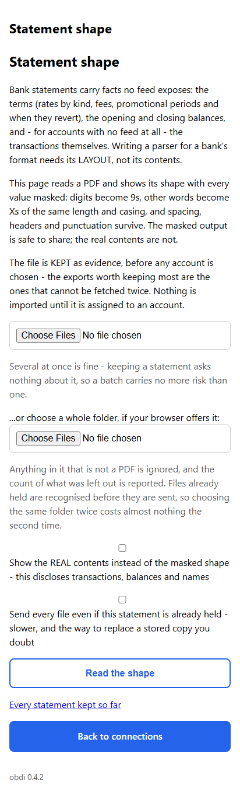
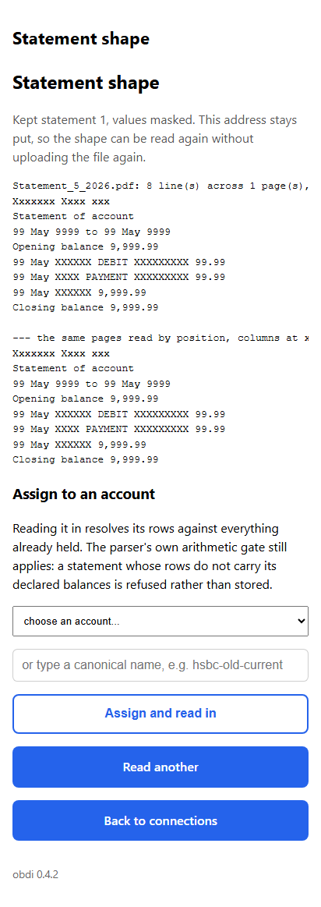
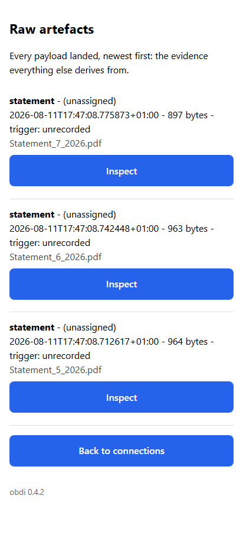

# open-banking-data-ingestion

A canonical local store for personal financial data, from which applications
(Actual Budget and any others worth evaluating) are populated by **replay**.

The point is not to sync a bank into a budgeting app. It is to own the data, so
that apps become disposable views over it: several can be trialled against the
same real dataset, abandoned without loss, and analysed well past what any of
them expose.

Built for UK accounts, where the aggregator landscape is unusually hostile to
individuals: the free tier everyone recommends closed to new signups, the
European alternative does not serve the UK at all, and most providers gate live
access behind a sales conversation. TrueLayer's Data API and the banks' own
first-party APIs are the routes that work.

## Where the data lives

**This repository holds code only.** No balances, no transactions, no account
identifiers, no statements. `.gitignore` enforces it, but the rule matters more
than the mechanism:

| What | Where | Why |
|---|---|---|
| Code (this repo) | here | shareable, reviewable |
| Secrets | `.env`, gitignored | never committed, never read by tooling |
| Raw artefacts + derived store | `OBDI_RAW_DIR` / `OBDI_DB_PATH`, outside the repo | private data |
| Statement PDFs | Paperless | already indexed, searchable and backed up |

Set `OBDI_TIMINGS=1` to have rebuilds report a per-phase timing breakdown
(parse, reconcile, resolve, transfer pairing) in the container log and on the
CLI. Off by default and free when off - it exists so performance questions
about the real deployment get measured answers rather than extrapolations.

A private Forgejo repo is the intended long-term home for the raw text exports:
CSV and QIF are text, so version control gives an append-only, provenance-stamped
archive for free — and shows you the diff when a bank silently changes its export
format. PDFs do not belong there; they neither diff nor compress.

## What it looks like

**Every figure in these images is invented.** They are produced by
`scripts/capture_screens.py`, which starts the real application against a store
in a temporary directory, lands statements built in that script with made-up
amounts, photographs the pages and throws the store away. Nothing real is
involved, which is what lets pictures live in a repository that holds no data.

Generated rather than taken by hand for a second reason: a screenshot is a
claim about the interface, and one nobody can regenerate keeps asserting a
layout that changed months ago. When the pages move, one command moves the
pictures with them — and a page that has started failing takes the script down
with it.

```
.venv/Scripts/python.exe scripts/capture_screens.py    # needs `playwright install chromium`
```

| Reading a statement | Its masked shape | Everything landed |
|---|---|---|
|  |  |  |

The middle one is the point of the PDF arm. Writing a parser for a bank's
statement needs its LAYOUT — column order, header wording, date format, how the
balance lines are phrased — and none of its contents. So a statement is shown
with every digit masked to a 9 and every word that is not recognisable
statement furniture masked to Xs of the same length and casing. The format
stays legible enough to write a parser from; the money does not appear.

## Architecture

```
   bank CSV / QIF / OFX          Open Banking API
   (manual download)             (Enable Banking, Starling, Monzo)
            |                             |
            +--------------+--------------+
                           v
                  [1] RAW ARTEFACTS          immutable, append-only,
                      verbatim payload       content-hashed, never edited
                      + provenance
                           |
                           v
                  [2] NORMALISE + RESOLVE IDENTITY
                      minor-unit integers, canonicalised descriptions,
                      tiered matching, internal-transfer pairing
                           |
                           v
                  [3] TRANSACTIONS  +  VALUATIONS  +  EVENTS
                      (derived; rebuildable from [1] at any time)
                           |
            +--------------+--------------+
            v              v              v
      Actual Budget    analysis        MQTT -> Home Assistant
      (replay)         (SQL, models)   (later)
```

Layer 1 is the deliverable. Everything else is derived, which means an improved
matching algorithm can be applied **retroactively** by rebuilding — whereas
discarded source data is gone once a bank's export window closes.

## Setup

Python 3.11+ (3.14 here). No pyenv needed — the `py` launcher on Windows already
manages versions, and a stdlib virtual environment handles isolation.

```bash
py -3.14 -m venv .venv
./.venv/Scripts/python.exe -m pip install -e ".[dev]"    # Windows
# source .venv/bin/activate && pip install -e ".[dev]"   # POSIX

./.venv/Scripts/python.exe -m pytest       # 56 tests, no credentials needed
./.venv/Scripts/python.exe -m ruff check .
```

`pyproject.toml` declares dependencies with floors matching what is tested;
`requirements.txt` pins the exact working set. If you later want a single faster
tool that also manages Python versions, `uv` replaces venv, pip and pyenv
together — not required, and nothing here depends on it.

Then copy `.env.example` to `.env` and fill it in. **`.env` is gitignored and is
never read by tooling in this repo.**

## Usage

```bash
# pull from live APIs
obdi pull starling                      # first-party, no consent clock
obdi pull halifax                       # a stored TrueLayer connection
obdi pull halifax --since 2026-01-01    # narrower window

# import downloaded files
obdi import path/to/export.csv --account starling-personal
obdi import path/to/savings.csv --account starling-savings

obdi pair-transfers      # after ingesting every account, by any route
obdi status

# emit an Actual Budget import payload
obdi replay --out ./actual-import.json
```

`pair-transfers` is a separate pass over the whole store, and has to be: a
movement between your own accounts has its two sides in *different* accounts,
so they arrive in different files on possibly different days. Left unpaired it
inflates both spending and income. Re-running it is harmless.

The parser is chosen by inspecting the header row. If no parser recognises it,
the import is **refused** rather than guessed at — a hard failure costs minutes,
a silent misparse corrupts the store and is discovered months later.

## Connecting a bank from a phone

```bash
obdi serve      # then reach it from the phone, however you reach your network
```

A page listing every connection with its consent clock, and a button to add or
reconnect one. Doing it from a phone means the bank's own app handles
authentication — biometrics rather than a password typed into a desktop browser
and a second factor juggled alongside it.

This works because the OAuth redirect is a **browser** event: the provider never
connects inbound, it sends the browser somewhere. So the flow needs only a page
your phone can reach — a VPN, a mesh network or anything else that gets your
handset to the service. **No public ingress is required**, which matters given
what the page can start. Bind it to loopback and let whatever you already use
for private access do the exposing.

For a permanent deployment, keep the stack definition outside this repo and have
it pull the image CI publishes rather than building on the host: build failures
then surface in CI instead of during a deploy, and a published tag is something
update-watching can compare. Render its configuration from whatever secret store
you already run, so credentials are never hand-written on the host. The
`compose.yaml` here builds from source and is for local development only.
Deployment detail: [`docs/DEPLOY.md`](docs/DEPLOY.md).

## Connecting a bank, and the 90-day chore

**Runbook: [`docs/REAUTHORISE.md`](docs/REAUTHORISE.md).** Written for someone
who remembers nothing, because that is who will be reading it.

UK Open Banking consent lasts about 90 days per bank and **cannot be renewed by
software**. Refresh tokens keep access tokens alive indefinitely while the
consent clock runs out underneath them, so the connection stops dead and needs a
human to re-authorise at the bank. It is a recurring manual chore.

Three commands:

```bash
python -m obdi.cli connections                                   # what needs doing
python scripts/truelayer_probe.py auth-link                      # open, approve at bank
python scripts/truelayer_probe.py exchange "<url>" --save <name> # save it
```

You should not need to look any of that up. `connections` prints the exact
re-authorisation commands when a consent is expiring, `auth-link` prints the
exchange command with your existing connection names filled in, and running
`truelayer_probe.py` with no arguments prints the whole sequence. Re-authorising
uses the **same name** as before, or you get a duplicate connection.

## Canonical accounts and cross-checking

One account can be pulled from several sources at once — an aggregator, the
bank's own API, a file export. This is deliberate: agreement between two
independent routes is evidence the data is right, disagreement is a finding, and
either route surviving an outage or a consent expiry keeps the record intact.

It requires binding each provider's account id to one canonical account, or the
sources form separate silos and the same payment is stored once per source.
Unmapped accounts fall back to a source-qualified id, so they stay visibly
separate rather than colliding — but they will not cross-check until bound.

Copy `docs/accounts.example.json` to the path in `OBDI_ACCOUNT_MAP` and fill in
your ids. To find them, just run a pull: **any unbound account is named in the
output**, since an unbound account still ingests but silently forgoes
cross-source matching, and a silent omission is the thing worth avoiding.

### Savings pots are accounts, not categories

A Starling Space (and any equivalent pot elsewhere) gets its **own canonical
account**. Moving money into one is a transfer between two accounts you own —
not spending.

This is worth stating because budgeting tools commonly get it wrong in one of
two directions. Treating the movement as external makes saving look like
spending and the return look like income, so the month reads as chaos. Silently
discarding it — which this project did until it was corrected — swaps that for
money that simply vanishes, and a pot balance you cannot see at all.

Both sides are therefore kept, in different accounts, and paired. The pairing is
what keeps them out of spending while preserving that the movement happened. It
also requires the Space to be a separate account: pairing matches across
accounts, so folding a Space into its parent leaves both sides unpairable.

`obdi pair-transfers` reports **confirmed** pairs, and separately reports
movements a provider *called* internal but which never paired — that means the
opposite side is missing, usually an account or space not yet ingested or bound.

Starling is the natural place to start, being the one account reachable both
first-party and through the aggregator. Running both calibrates how far two
providers' descriptions of the same payment diverge in practice — which tells
you how much to trust matching on the accounts you can only see one way.

One consequence surfaces in the comparison reports: a bank statement shows the
**main account's view** of movements the feed files under a space — a bill paid
directly from a space appears on the statement as the account's own spending,
and a space top-up appears as the main leg only. So when two sources disagree
about an account, rows only one of them holds are searched for among the other
source's **sibling accounts** (everything the same source feeds, per the
account map). A match is reported as an attribution naming the sibling — never
silently absorbed — and whatever stays unmatched is printed, because the
residue is the finding.

## Assets that have no transaction stream

A pension pot, a fund or a property is not a ledger you sum — it is a value you
*observe*, where the change between observations mixes contributions, growth and
fees that a statement rarely separates.

```bash
obdi value workplace-pension --kind defined_contribution \
    --on 2026-04-05 --amount 42317.00 \
    --units 24210.55 --unit-price 174.80 --document paperless:1234
```

**Record units and unit price whenever the statement gives them.** Nothing reads
them yet. Keeping only the total forecloses proper unit-and-price modelling
permanently; keeping both costs two columns.

**Defined benefit has no pot**, so recording one is refused. Store the accrued
annual income — the fact a statement actually supplies — and derive any capital
figure from a multiplier held as configuration. There is no agreed convention:
the annual allowance test uses 16, the abolished lifetime allowance used 20, a
scheme's own transfer value is lower again and actuaries warn it understates the
member's benefit. The right answer depends on the question, so it must be
re-runnable rather than baked in.

**State pension is excluded from wealth** and capitalising it is refused —
without a contractual entitlement it is a social benefit, and belongs in
projected income.

## Replaying into Actual Budget

Replay, not sync. The store is the record; Actual is a view over it. That is
what makes Actual **disposable** — wipe the budget, replay, lose nothing. It is
also what lets you run a second budgeting tool alongside it on the same real
data, and drop whichever loses.

```bash
obdi replay --out ./actual-import.json
```

Accounts with no Actual binding are **not** replayed and are named in the
output, because a budget quietly missing an account looks like missing spending.
Internal transfers are excluded by default: both sides are real movements, but
counting them inflates spending and income alike, and Actual models transfers
as their own type which a flat import cannot express.

### Why the payload rather than a direct write

Actual's write path is Node-only. `@actual-app/api` embeds Actual's own budget
engine and runs its JavaScript migrations, so it is versioned in lockstep with
the server. The Python reimplementation is good for reading but its own
documentation warns against using it to create budgets — exactly what a rebuild
does. So this emits the payload and a small pinned Node process applies it,
confining the polyglot split to one container whose only job is to track
Actual's version.

The applier must use Actual's **import** path, never the raw insert: the raw one
skips reconciliation and silently duplicates on any re-run. Three things then
fall out for free:

- **`imported_id` is the idempotency key**, and ours is the content identity
  (content key + occurrence) rather than the internal entity id - entity ids
  re-mint on a store rebuild, while the content key is deterministic over the
  payment itself. The same payment maps to the same row on every replay,
  across re-runs, sources and rebuilds alike.
- **On a match, existing values win.** Actual keeps a payee, category or note
  you set by hand rather than overwriting it, and never touches a reconciled
  transaction. Re-importing does not undo your categorisation.
- **A full rebuild** uses Actual's import mode against a fresh budget file,
  which is cleaner than deleting in place.

## What needs an account

Only the first item is needed to start. File import needs no credentials at all.

| Provider | Needed? | What to get |
|---|---|---|
| **Starling** | only if you bank there | personal access token, read-only scopes |
| **Monzo** | only if you bank there | **confidential** client id + secret |
| **Actual Budget** | later, for replay | server URL, password, sync id |
| Enable Banking | EEA accounts only | personal tier has no UK; see below |
| TrueLayer | no | live access is sales-gated; sandbox is fake data |
| GoCardless | no | closed to new signups since 2025 |

**Enable Banking does not serve the UK** (established 2026-08-01). Its
account-linking country selector has no GB entry; an unactivated application
returns `403 Application is not active`; the console states that individuals
activate only by linking accounts; and the *commercial* quote-request form also
omits the United Kingdom. So this is an uncovered market rather than a tier
restriction, and no amount of paying changes it. Keep the registered
application only if you hold an account with an EEA-registered entity — Revolut
and Wise both operate one — since Ireland and Lithuania are selectable.

Routes still worth testing, none confirmed here:

- **TrueLayer** and **Tink** consoles. A developer building UK sync for Actual
  and Firefly III reports running live data-only applications on TrueLayer
  without ever being asked for a payment method, then moving to Tink for wider
  UK coverage. Working community integrations exist for both.
- **LunchFlow** — a paid hosted service holding the aggregator relationships
  (GoCardless among them, which is how it reaches UK banks), pushing into a
  self-hosted Actual via `lunchflow/actual-flow`. Self-serve. One real test
  reported UK connections stuck "pending" for hours, so treat reliability as
  unproven.

**File import is the dependable floor regardless**, which is why it is what
this repo implements first.

Notes that will save time:

- **Starling** tokens do not expire and carry no 90-day consent cycle, because
  first-party access to your own bank is not an account information service.
  Grant only `account:read`, `balance:read`, `transaction:read`, `space:read`.
- **Monzo** must be registered as a *confidential* client — only those receive
  refresh tokens. And full transaction history is available **only within five
  minutes of authenticating**; after that it serves a rolling 90 days. The
  backfill has to be armed and waiting before you authorise.
- **Enable Banking** requires the "Activate by linking accounts" step. That step
  *is* the restricted-production mechanism, not a corporate hoop to skip:
  restricted applications can only read accounts linked to them.

## Standing obligation: download exports now

Machine-readable export windows are far shorter than PDF archives, and the gap
**cannot be backfilled**. Roughly: HSBC six weeks of CSV against six years of
PDF; NatWest three months against seven years; Lloyds and Halifax three to six
months against seven to ten.

Every month of delay is structured data permanently lost. Download on a cadence
shorter than the tightest window you rely on — six weeks sets the pace — and
land the files here. This needs no code and should not wait for any of it.

## Known format hazards

Each of these is encoded in a test, because each corrupts data silently:

- **Amex UK inverts its signs** — a spend is positive. Storing it unchanged
  reverses the entire card balance.
- **Amex UK dates `DD/MM`, the US export `MM/DD`.** No US parser can be reused.
- **Monzo CSV carries a UTF-8 BOM**, which glues an invisible character to the
  first column name and breaks header matching for no visible reason.
- **Starling CSV has no transaction id** (unlike its API), so identity rests
  entirely on the content key.
- **Santander caps a download at 600 rows, NatWest at three months**, forcing
  overlapping pulls — deduplication is mandatory, not a nicety.
- **NatWest's OFX is officially broken** above 32-character narratives, and can
  import credits as debits. Prefer CSV everywhere.

## Design decisions worth knowing

**Money is always an integer of minor units.** Never a float. Rounding noise is
a documented cause of failed matching in other importers.

**Identity is tiered and never guesses**: exact provider id, then exact content
key, then fuzzy (same account, exact amount, ±7 days, nearest date first), then
*unresolved* — flagged, not silently merged. The match tier is recorded on every
link so a wrong match can be found and reversed.

**Pending → settled is supersession, not update.** A settling transaction often
arrives with a new provider id and a shifted date. The entity keeps its
identity, both raw payloads are retained, and the rebuild stays reproducible.

**Normalisation is deliberately conservative.** Under-matching falls through to
review; over-matching silently merges two real payments and is very hard to
spot.

**Valuations are not transactions.** A pension or property is a value *observed*
periodically, where the delta mixes contributions, growth and fees. Flattening
that into a plug transaction destroys units, unit price, provenance and the
contributions/growth split. Capture units and unit price whenever a statement
gives them, even though nothing consumes them yet.

## Status

Working: file import end to end — land raw, parse, normalise, resolve identity,
store — plus cross-account internal-transfer pairing. Starling, Monzo and Amex
UK CSV parsers, with layouts taken from research rather than real exports —
**verify each against a first real download**; the header check will refuse a
mismatch rather than misread it.

Also working: live pulls from TrueLayer and Starling, connection storage with
consent tracking, cross-source matching with source tiers, savings spaces as
accounts, valuation recording for assets with no transaction stream, a
phone-usable connection interface, a Docker stack, and Actual replay payload
generation.

Not built yet: the **Node applier** that consumes the replay payload — it needs
a reachable Actual server to verify against, so it is deliberately unwritten
rather than shipped unverified — plus MQTT events and a review interface for
the flagged-but-undecided queue.

Assurance: 304 tests, `mypy --strict` clean, `ruff` clean under a widened rule
set including annotations, security, timezone and pathlib families. An
adversarial multi-lens review found 33 defects in an earlier state of this code
that had 189 tests passing, four of them silent data loss; all are fixed and
covered by regression tests that name the scenario rather than the mechanism.

`scripts/check_uk_coverage.py` answers the outstanding design question — whether
Enable Banking actually carries your banks.
